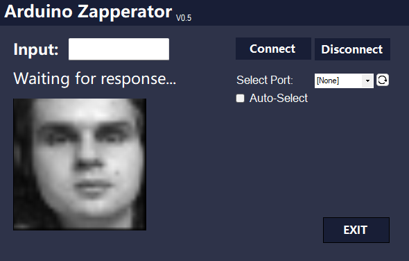

# Arduino-Controller-Ui
A c# application for controlling arduino uno

This application was made as a part of a group project, thats why data types for input and output may seem odd. This app was made solely by me. Here is some more description about this application:

The Arduino interface application is important for the communication of Arduino. As we did not
use a keyboard or a 7-segment display, it is not possible to see what happens in the Arduino
without using the native Arduino IDE serial monitor, which does not allow that data to be used in
the outer environment. The interface is called Arduino Zapperator, and it allows the user to
select the port, connect, disconnect, send input, and get output. It can categorize the incoming
message as either device login response, temp key response, error message, or image data.
Based on the categorization, the rest of the process is done.

The problem with this interface application is, in the developing process because everyone in
the group needs to work with arduino, we have used an Arduino uno which was available at the
time. We assumed that arduino uno and arduino nano would use the same serial connection but
unfortunately we learned late that they use different communication. Because arduino nano
required a specific communication protocol we could not change the functionality accordingly.

The image refers to the current look of the interface, more detailed explanation and process of interface creation can be found in the "design-progress.pdf" file.

